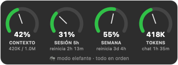
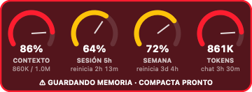

# 🐘 Elephant Mode

> *Los elefantes nunca olvidan. Ahora Claude Code tampoco.*

[English](README.md) · **Español**


Activa el Modo Elefante: un plugin para Claude Code que hace que **guarde su memoria antes de olvidar**. Cuando la conversación se llena, Claude anota lo importante y luego se compacta solo. Una pequeña pantalla flotante muestra qué tan cerca estás de cada límite.

<p>
  
  
</p>

## El problema

Cuando una conversación de Claude Code llena su ventana de contexto, se **compacta automáticamente**: la conversación se resume y los detalles se pierden. Se pierde todo lo que no quedó escrito: las reglas que le diste hace una hora, las decisiones y el trabajo a medias. Si no estás frente a la pantalla (porque usas Claude desde el teléfono o en una tarea larga que corre sola), no puedes intervenir para guardarlo.

Hay hooks que se disparan *durante* y *después* de compactar, pero ninguno se dispara *antes*, en el porcentaje que tú elijas. Ese es el hueco que llena este plugin.

## Qué hace

| Cuándo | Qué pasa |
|---|---|
| El contexto llega al **80 %** | Claude recibe la orden de guardar en su memoria las reglas nuevas, las decisiones y los datos del proyecto. También escribe notas de continuidad: qué está haciendo, qué quedó a medias y cuál es el siguiente paso. Funciona incluso a mitad de una respuesta larga. |
| El contexto llega al **85 %** | Se compacta con el auto-compact propio de Claude Code, antes de lo normal, cuando todavía hay espacio. |
| Justo después de compactar | Claude vuelve a leer sus notas y sigue donde iba. |
| El límite de 5 horas o el semanal llega al **85 %** | Guarda memoria igual, para que no se pierda nada si la sesión se corta. |
| Siempre (macOS) | Pantalla flotante transparente con contexto, límite de 5 h, límite semanal y tokens. Se arrastra a cualquier lugar y se pone roja al 85 %. |

Todo es automático y silencioso. No hay comandos que recordar.

## Instalación

En Claude Code:

```
/plugin marketplace add SIPAMOCHA1985/elephant-mode
/plugin install elephant-mode@elephant-mode
```

Reinicia Claude Code y listo. En la primera sesión, el plugin:

- agrega una línea de estado (`ctx 42% · 5h 31% · 7d 55%`) **solo si no tienes una propia**;
- pone `CLAUDE_AUTOCOMPACT_PCT_OVERRIDE=85` **solo si no lo configuraste tú**;
- antes de tocar tu `settings.json` guarda una copia, y te dice una vez qué cambió.

**Requisitos:** Claude Code y Python 3.9 o superior.
- En macOS, Python viene con las Command Line Tools de Xcode, que `git` ya necesita para instalar plugins.
- La pantalla viene ya compilada para Apple Silicon e Intel (macOS 13+). No hay que compilar nada ni comprar hardware.
- En Linux funcionan el guardado de memoria y la línea de estado; por ahora la pantalla es solo para Mac.
- En Windows funcionan el guardado de memoria y la statusline (el medidor es solo Mac por ahora). Instala Python desde [python.org](https://www.python.org/downloads/); el alias `python3` de la Microsoft Store se ignora solo. Claude Code ya exige Git for Windows, que trae la shell donde corren los hooks.

### Codex (beta)

El mismo guardado de memoria funciona en Codex CLI de OpenAI (0.160+), en macOS, Linux y Windows:

```
codex plugin marketplace add SIPAMOCHA1985/elephant-mode
codex plugin add elephant-mode@elephant-mode
```

Reinicia Codex, ejecuta `/hooks` y aprueba los cuatro hooks de elephant-mode (Codex no los corre hasta que los revisas). El % de contexto, el tamaño de la ventana y los límites de 5 horas y semanal se leen del propio registro de sesión de Codex, así que los guardados al 80 % y 85 % funcionan igual que en Claude Code. Diferencias: la memoria va a un archivo `memory.md` en la carpeta de datos del plugin (la memoria interna de Codex no se toca), no hay statusline ni medidor, y el plugin no cambia el umbral de autocompactado de Codex (`model_auto_compact_token_limit` en `config.toml` lo decides tú).

## Cómo funciona

Usa solo funciones oficiales de Claude Code: hooks, línea de estado y auto-compact. No llama a ninguna API ni evade los límites de uso: solo los muestra y te ayuda a no perder trabajo.

- **Hooks `PostToolUse` y `Stop`:** se ejecutan después de cada herramienta y al final de cada respuesta. Leen el % de contexto y, al llegar al 80 %, le dan a Claude la orden de guardar.
- **Hook `PreCompact`:** se ejecuta al compactar. Prepara el siguiente ciclo y, si lo activas, guarda una copia local de la conversación (apagada por defecto).
- **Hook `SessionStart` (compact):** se ejecuta después de compactar y le recuerda a Claude que lea sus notas.

### La instrucción exacta que recibe Claude

No hay instrucciones ocultas. El texto completo está en inglés en [`scripts/funnel.py`](scripts/funnel.py) y en el [README en inglés](README.md#the-exact-instruction-claude-receives). En resumen, le pide a Claude que:
1. guarde en su memoria las reglas nuevas, las decisiones y los datos del proyecto;
2. escriba las notas de continuidad;
3. lo haga en silencio y siga con la tarea.

## Configuración

Se cambia en `/config` (opciones del plugin):

| Opción | Por defecto | Qué hace |
|---|---|---|
| `save_pct` | 80 | % de contexto en el que guarda memoria |
| `compact_pct` | 85 | Umbral de auto-compact que se escribe en la primera sesión (solo si no tienes uno) |
| `limit_pct` | 85 | % del límite de 5 h o semanal en el que guarda memoria |
| `context_window` | 200000 | Tamaño de la ventana. Solo se usa si la línea de estado no es la del plugin, y se corrige solo hacia arriba |
| `backups` | **apagado** | Guardar una copia local de la conversación completa antes de cada compact |
| `backup_keep` | 10 | Cuántas copias conservar |
| `quiet` | apagado | No mencionar los cambios de la primera sesión |

## Privacidad

**Nada sale de tu máquina.** El plugin no hace ninguna conexión a internet. En [PRIVACY.md](PRIVACY.md) está exactamente qué guarda en disco y por cuánto tiempo.

## Desinstalar

```
/elephant-mode:uninstall
/plugin uninstall elephant-mode
```

El primer comando quita solo lo que agregó el plugin (su línea de estado y el umbral de compact) y cierra la pantalla. Si te lo saltas, la pantalla igual se cierra sola cuando el plugin ya no está. Pero la línea de estado queda en tu `settings.json` apuntando a un archivo borrado: quita `statusLine` de ahí o restaura la copia que hizo el plugin.

## Preguntas frecuentes

**¿En qué se diferencia de claude-mem?** [claude-mem](https://github.com/thedotmack/claude-mem) es un sistema completo de memoria: graba todo y lo comprime con IA. elephant-mode es lo contrario: unos pocos scripts, sin dependencias ni base de datos, y usa la memoria propia de Claude Code. Hace una sola cosa: guardar memoria *antes* de compactar, en el % que tú elijas. Se pueden usar juntos.

**¿El guardado está garantizado?** No. El plugin le *pide* a Claude que escriba su memoria y sus notas, y casi siempre lo hace, pero un hook no puede escribirlas por él (solo el modelo sabe qué importa). Si el turno se corta antes, no se guarda nada. `log.jsonl`, en la carpeta de datos del plugin, registra cada petición y, en el siguiente compactado, si las notas y la memoria se escribieron de verdad.

**¿Gasta tokens extra?** Un paso extra por cada ciclo, mientras Claude escribe sus notas. A cambio, como compacta antes, los mensajes que siguen pesan menos.

**¿Por qué la pantalla no tiene botón de cerrar?** Está pensada para estar siempre a la vista. Puedes arrastrarla a cualquier esquina; si no la quieres, desinstala el plugin.

## Licencia

[MIT](LICENSE) © 2026 John Sipamocha

---

Proyecto independiente de la comunidad. No está afiliado a Anthropic ni cuenta con su respaldo o patrocinio. Claude y Claude Code son marcas de Anthropic, PBC.

Creado por John Sipamocha, creador de [TramitAI](https://tramit-ai.com).
