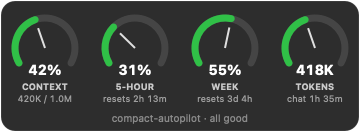

# 🐘 Elephant Mode

> *Elephants never forget. Now Claude Code doesn't either.*

**English** · [Español](README.es.md)


Turn on Elephant Mode: a plugin for Claude Code that makes it **save its memory before it forgets**: when the conversation gets full, Claude writes down what matters, then compacts on its own. A small floating gauge shows how close you are to every limit.

<p>
  
  
</p>

## The problem

When a Claude Code conversation fills its context window, it **auto-compacts**: the conversation is summarized and the details are gone. Rules you gave it an hour ago, decisions, half-finished work: whatever wasn't written down is lost. If you're away from the screen (running Claude through a phone gateway, or a long autonomous task) you can't step in to save it.

Hooks exist for *during* and *after* compaction, but nothing fires *before* it at a threshold you choose. That's the gap this plugin fills.

## What it does

| When | What happens |
|---|---|
| Context reaches **80 %** | Claude is told to save new rules, decisions and project facts to its memory, and to write continuity notes (what it's doing, what's half-done, the next step). It works even in the middle of a long turn. |
| Context reaches **85 %** | Claude Code's own auto-compact runs, earlier than its default, while there's still room. |
| Right after compacting | Claude is pointed back to its continuity notes and picks up where it left off. |
| 5-hour or weekly usage limit reaches **85 %** | Same memory save, so nothing is lost if the session gets cut off. |
| Always (macOS) | A transparent floating gauge: context, 5-hour limit, weekly limit, tokens. Drag it anywhere. It turns red at 85 %. |

Everything is automatic and silent. No commands to remember.

## Install

In Claude Code:

```
/plugin marketplace add SIPAMOCHA1985/elephant-mode
/plugin install elephant-mode@elephant-mode
```

Restart Claude Code. That's it. On the first session the plugin:

- adds a statusline (`ctx 42% · 5h 31% · 7d 55%`) **only if you don't already have one**;
- sets `CLAUDE_AUTOCOMPACT_PCT_OVERRIDE=85` **only if you haven't set it yourself**;
- backs up your `settings.json` first, and tells you once what it changed.

**Requirements:** Claude Code and Python 3.9+. On macOS, Python comes with the Xcode Command Line Tools, which `git` (and therefore plugin installs) already needs. The gauge is a prebuilt universal binary (Apple Silicon and Intel, macOS 13+): nothing to compile, no extra hardware. On Linux the memory save and statusline work; the gauge is macOS-only for now. Windows is untested.

## How it works

```
 every tool call / end of turn                 compaction                        after
┌──────────────────────────────┐   ┌──────────────────────────────┐   ┌─────────────────────────┐
│ PostToolUse + Stop hooks     │   │ PreCompact hook              │   │ SessionStart (compact)  │
│ read context % from the      │──▶│ re-arm the 80 % trigger;     │──▶│ "read your continuity   │
│ transcript; at 80 % tell     │   │ optional local transcript    │   │  notes and carry on"    │
│ Claude to save memory + notes│   │ backup (off by default)      │   │                         │
└──────────────────────────────┘   └──────────────────────────────┘   └─────────────────────────┘
          ▲  Claude Code's own auto-compact fires at 85 % (CLAUDE_AUTOCOMPACT_PCT_OVERRIDE)
```

It only uses official Claude Code features (hooks, statusline, auto-compact). It doesn't call any API and doesn't get around usage limits: it shows them and helps you not lose work.

### The exact instruction Claude receives

No hidden prompts. This is the full text, from [`scripts/funnel.py`](scripts/funnel.py):

> [elephant-mode] {reason}. Claude Code will auto-compact soon and the details of this conversation will be summarized away. Before continuing:
> 1. Save to your memory ({memory}) anything from this session worth keeping across sessions: new rules or corrections from the user, decisions made, and facts about the project. Update existing entries instead of duplicating them.
> 2. Overwrite {continuity} with continuity notes: what you are working on, what is half-done, the exact next step, files touched, and any pending user requests.
> 3. Do this quietly, then carry on with the task. Do not ask the user about it.

## Settings

Change them in `/config` (plugin options):

| Option | Default | What it does |
|---|---|---|
| `save_pct` | 80 | Context % at which memory is saved |
| `compact_pct` | 85 | Auto-compact threshold written on first run (only if you haven't set one) |
| `limit_pct` | 85 | 5-hour / weekly limit % at which memory is saved |
| `context_window` | 200000 | Window size, used only when the statusline isn't ours. Corrects itself upward if usage goes past it |
| `backups` | **off** | Keep a local copy of the full conversation before each compaction |
| `backup_keep` | 10 | How many backups to keep |
| `quiet` | off | Don't mention the first-run changes |

## Privacy

**Nothing leaves your machine.** The plugin makes no network requests. See [PRIVACY.md](PRIVACY.md) for exactly what it stores on disk and for how long.

## Uninstall

```
/elephant-mode:uninstall
/plugin uninstall elephant-mode
```

The first command removes only what the plugin added (its statusline and the compact threshold) and closes the gauge. If you skip it, the gauge still closes by itself once the plugin is gone, but the statusline entry stays in your `settings.json` pointing to a deleted file: remove `statusLine` there, or restore the backup the plugin made.

## FAQ

**How is this different from claude-mem?** [claude-mem](https://github.com/thedotmack/claude-mem) is a full persistent-memory system that records everything and compresses it with AI. elephant-mode is the opposite size: a few small scripts, no dependencies, no database, built on Claude Code's own memory. It does one thing, which is to save memory *before* compaction and at a threshold you choose. They can be used together.

**Does it cost extra tokens?** One extra step per compaction cycle, while Claude writes its notes. Compacting earlier then makes every following message lighter.

**Why does the gauge have no close button?** It's meant to stay visible. Drag it to any corner, or uninstall the plugin to remove it.

## Development

```
python3 tests/test_funnel.py
python3 tests/test_setup.py
widget/build.sh            # rebuild the gauge (CI builds the committed binary)
claude plugin validate .
```

Contributions welcome: see [CONTRIBUTING.md](CONTRIBUTING.md).

## License

[MIT](LICENSE) © 2026 John Sipamocha

---

Independent community project. Not affiliated with, endorsed by, or sponsored by Anthropic. Claude and Claude Code are trademarks of Anthropic, PBC.

Built by John Sipamocha, creator of [TramitAI](https://tramit-ai.com).
